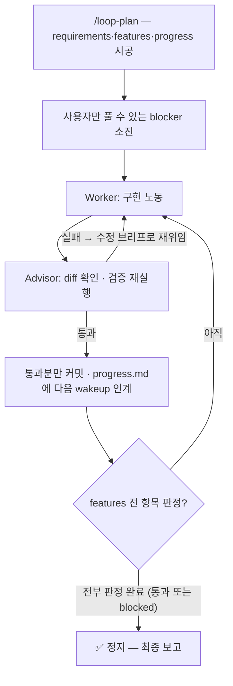

# my-agent-harness

혹시 이런 적 있으신가요. 어제 30분을 갈아 넣어 겨우 고친 버그가 있습니다. 원인도 찾았고
해결책도 손에 넣었는데, 오늘 새 세션을 열면 에이전트는 그 얘기를 처음 듣습니다. 같은 자리,
같은 30분. 세션은 끝나면 사라지니까요.
**이 하네스는 세션이 남긴 것을 repo에 붙잡아 둡니다.** GitHub **"Use this template"** 으로
찍어 쓰는 에이전트 하네스 템플릿입니다. 이름은 거창하지만 시작에 필요한 건 아래 명령 세 줄이
전부이고, 나머지는 나중에 읽으셔도 됩니다.

## 🎁 무엇이 좋아지나

| | 어떻게 달라지나 |
|---|---|
| 🧠 **기억** | 어제 알아낸 걸 오늘 세션이 알고 시작합니다. 지식은 `wiki/`에 쌓이고, 사람이 승인한 것만 신뢰되고, 낡으면 기계가 표시해 줍니다 |
| 🔁 **무인 구현 루프** | 스펙을 파일에 박아두면 `loop`가 사이클을 굴립니다. 통과한 것만 커밋되니 자리를 비워도 됩니다 |
| 👥 **역할 분담** | 판단은 메인 세션(Advisor)이 하고, 손이 많이 가는 구현은 서브에이전트(Worker)가 맡습니다 |

용도는 정해두지 않았습니다. 서비스 개발이든 인프라 구축이든 공부 노트든, `/wiki-start`가 상황을 인터뷰해 거기 맞게 시공합니다.

## 빠른 시작

```bash
# GitHub에서 "Use this template" → 새 repo 생성 후:
git clone <이 템플릿으로 만든 repo URL> my-agent-harness && cd my-agent-harness

scripts/setup.sh    # githooks 활성화 + 도구·이름 검사 (몇 번 돌려도 안전)
claude              # repo 루트에서 실행 → trust 다이얼로그 수락
/wiki-start         # 상황 인터뷰 → 위키 시공 (최초 1회)
```

**필요한 것** · git, python3 + PyYAML, Claude Code CLI. gitleaks는 선택이지만 깔아두면 비밀이 커밋되기 전에 로컬에서 먼저 걸립니다.

## 시작하면 무슨 일이 일어나나

**처음 5분.** `scripts/setup.sh`가 훅을 걸고, `claude`를 루트에서 띄워 trust를 수락합니다.
trust 전에는 공유 권한·훅·스킬이 전부 잠들어 있으니 이 단계는 건너뛰지 마세요.

**그다음 10분.** `/wiki-start`가 질문을 몇 개 던집니다 — 무슨 일을 하는 repo인지, 혼자 쓰는지
팀이 쓰는지. 답을 듣고 위키의 방 구조(섹션·태그·규약)를 설계해 보여주고, 승인하면 시공합니다.

**그 뒤로는 평소처럼.** 코딩하고, 디버깅하고, 물어보세요. 기록할 값어치가 있는 게 나오면
에이전트가 초안을 보여주며 먼저 제안하고, 승인하면 커밋합니다. 세션을 닫기 전 `/wiki-record`만 습관으로 만들면 됩니다.

> 전부 이해하실 필요는 없습니다. 규칙은 에이전트가 이미 읽고 있고 필요한 순간에 먼저 물어봅니다.
> 아래 내용은 궁금해졌을 때 돌아와서 읽으셔도 늦지 않습니다.

## 기억 — 위키

위키의 리듬은 이렇습니다.

| 시점 | 무슨 일이 |
|---|---|
| 최초 1회 | `/wiki-start` — 인터뷰로 섹션·태그·규약을 설계하고 승인받아 시공 |
| 세션 중 | 기록 트리거 감지 → 보여주고 → 승인 → `verified`로 커밋 **(유일한 기록 경로)** |
| 세션 끝 | `/wiki-record` — 세션을 되짚어 남길 지식을 기록 **(마지막 기회)** |
| 분기마다 | `/wiki-curate` — 남은 draft와 만료 문서 처분 |
| 상시 | pre-commit·CI가 형식·비밀·규격·만료를 기계적으로 검사 |

"마지막 기회"는 진심입니다. 나중에 알아서 주워 담아주는 장치는 없어서,
**세션이 닫히기 전에 적지 않은 지식은 그냥 사라집니다.** 기억해 둘 규칙은 셋뿐입니다.

- **verified만 믿는다** — draft는 누구나 쓸 수 있지만, 사람이 읽고 승인해야 verified가 됩니다.
- **낡음은 기계가 표시한다** — 유효기한이 지나면 lint가 만료 배너를 알아서 답니다.
- **트리거 없는 기록은 노이즈다** — 30분+ 삽질, 반복 질문, 사고, 되돌리기 어려운 결정. 그것만.

한 가지 더. **위키 하나는 repo 하나를 기억합니다.** 프로젝트가 여럿이면 한 위키에 몰아넣지 말고
템플릿을 한 벌 더 찍으세요 — 방이 프로젝트 이름으로 채워지는 순간 위키는 검색되지 않는 서랍이
됩니다. 전체 규칙은 [wiki/SCHEMA.md](wiki/SCHEMA.md)에 있고, 기록 전에 에이전트가 읽습니다.

## 무인 구현 루프 — loop

기억이 바닥이라면 loop는 그 위에 올라가는 층으로, 구현을 무인 사이클로 굴립니다. 루프는 하나뿐이라 작업이 크든 작든 같은 구조를 쓰고 분량만 거기 비례합니다.



사이클을 실제로 돌리는 건 Claude Code 내장 `/loop`(주기 재실행)이고, 상태는 전부
`docs/projects/<slug>/` 아래 파일에 있습니다 — 모델의 기억이 아니라 파일이 진실입니다.

이 그림의 힘은 **작성자와 채점자가 다르다**는 데서 나옵니다. Worker는 코드를 쓰되 커밋하지
않고, Advisor는 "다 됐습니다"를 믿지 않고 diff와 검증을 직접 다시 돌려 통과분만 승인합니다.
커밋 직전에는 구현 과정을 모르는 `reviewer` 서브에이전트가 새 눈으로 한 번 더 봅니다.

절차 원본은 [docs/loop/](docs/loop/)(사이클 루틴·검증 사다리·함정 목록·상태 파일 스키마), 위임 규약 원본은 [docs/harness-guide.md](docs/harness-guide.md)에 있습니다.

## 스킬

외울 필요는 없습니다. 에이전트가 상황을 보고 먼저 제안하는 편이 더 잦습니다.

| 스킬 | 언제 |
|---|---|
| `/wiki-start` | 최초 1회 위키 시공 — 인터뷰로 섹션·태그·규약 설계 |
| `/wiki-record` | 세션에서 얻은 지식을 승인받아 verified로 기록 |
| `/wiki-curate` | 분기 큐레이션 — 남은 draft·만료·고아 문서 처분 |
| `/wiki-import` | 위키 밖 문서 뭉치(작업 로그·런북·노트)를 증류해 이식 |
| `/loop-plan` | loop로 굴릴 작업의 스펙과 상태 파일 시공 |
| `/handoff` | 다른 세션·다른 머신·다른 사람이 이어받을 인계문 작성 |

정본은 `.claude/skills/<이름>/SKILL.md`이고, `.agents/skills/`에는 AGENTS.md 규약을 읽는 다른 런타임을 위해 **정본을 가리키는 얇은 래퍼**만 둡니다(복제하면 `skill-lint`가 잡습니다).

<details>
<summary><b>⚙️ 기계 장치 — 문서는 권고, 이쪽은 강제</b></summary>

| 장치 | 하는 일 |
|---|---|
| `scripts/wiki-lint.py` | 위키 형식 검사 + 색인 재생성 + 만료 배너 삽입·제거 |
| `scripts/skill-lint.py` | 스킬 정본·래퍼 쌍과 서브에이전트 frontmatter 규격 검사 |
| `scripts/loop-lint.py` | loop 상태 파일 형식 검사 + requirements·verify 문구 휴리스틱 |
| `scripts/wiki-e2e.sh` | lint 게이트 E2E 회귀 스위트 (임시 사본에서 실행 — 워킹트리는 그대로) |
| `scripts/wiki-stale-check.py` | 근거 코드가 바뀌거나 사라진 걸 감지해 낡은 문서를 표시 |
| `scripts/githooks/` | pre-commit(gitleaks + 변경 영역별 lint) · commit-msg(위키 커밋 장부 형식) |
| `.github/workflows/ci.yml` | 서버 측 최후 방어선 — wiki-lint·skill-lint·loop-lint + gitleaks 전 이력 스캔 |

색인(`wiki/index.md`)도 장치의 일부입니다. 단순 목록이 아니라 **운영 신호판**이라서, 전체·방별 집계(검증됨/초안/만료)와 상한 초과 경고, 만료 표시, 신뢰 순 정렬이 lint를 돌릴 때마다 새로 그려집니다.

</details>

<details>
<summary><b>🏗️ 왜 빈 채로 오나 — 뼈대와 시공</b></summary>

이 템플릿은 일부러 **"시공 전"** 상태로 출고됩니다 — 섹션도 태그도 비어 있습니다.
위키가 죽는 이유(낡은 문서 → 신뢰 붕괴, 잡음 축적, 자동화의 조용한 죽음, 비대화)를 막는
장치는 어떤 상황에서도 필요하니 **뼈대**에 고정해 뒀습니다. 반대로 섹션 구성·태그·연결
관례처럼 상황을 타는 것은 비워두고, `/wiki-start`가 인터뷰로 채웁니다.

```text
개발 프로젝트 →  예: knowledge / decisions / troubleshooting
인프라 구축   →  예: architecture / runbooks / incidents
학습         →  예: fundamentals / deep-dives / questions  + "## 관련" 연결 관례
그 밖에      →  프리셋이 아니라 인터뷰로 설계
```

시공 전에는 lint가 문서 기록을 막습니다. 방도 안 만들고 이삿짐부터 들이지는 않으니까요.

**뼈대에 들어 있는 것 — 지속 가능성의 7조건**

| 조건 | 구현 |
|---|---|
| 신뢰 게이트 | draft→verified, 사람 승인 필수 |
| 원본 우위 | `sources` 필수, 불일치하면 원본이 이김 |
| 시간 방어 | 만료 배너, stale-check |
| 노이즈 필터 | 기록·조회 트리거, 크기 상한 |
| 삭제 가능성 | 삭제 사유가 장부에 남아 재기록 차단 |
| 기계 강제 | lint 3종·gitleaks·githooks·CI |
| 거버넌스 | 책임자(DRI) + 분산 검증 |

</details>

<details>
<summary><b>🔧 기존 프로젝트에 얹기 / 손볼 곳</b></summary>

기존 repo에 얹으려면 `wiki/`, `docs/`, `scripts/`, `.claude/`, `.agents/`,
`.github/workflows/ci.yml`, AGENTS.md, `.gitignore` 항목을 복사합니다. `CLAUDE.md`는 symlink라서
복사 대신 다시 만들어 주세요(`ln -s AGENTS.md CLAUDE.md`). 기존 `.claude/settings.json`이 있으면
hooks·permissions를 손으로 합친 뒤 `scripts/setup.sh`. 손볼 곳은 드물지만 세 군데 있습니다.

- 에이전트의 `git push`는 기본 차단 → 허용하려면 `.claude/settings.json` deny에서 제거
- repo 안에 독립 하위 repo를 두는 구조 → `scripts/wiki-stale-check.py`의 `SUBREPOS`
- 기본 브랜치가 main이 아님 → `ci.yml`

</details>

<details>
<summary><b>📤 외부 발행 · 👤 거버넌스</b></summary>

**외부 발행.** 이 하네스에 발행 기능은 들어 있지 않습니다. 대신 위키 문서를 블로그·사내 포털 같은
외부 매체로 내보내는 파이프라인을 꽂을 자리와 규약만 정의합니다 — 스킬·스크립트의 위치, `.env` 밖으로
키를 흘리지 않는 비밀 취급, 내부 사실을 지우는 세탁과 사용자 정독 게이트, 발행 식별자 추적.
붙이기 전에 [docs/publish-slot.md](docs/publish-slot.md)를 읽어보세요.

**거버넌스.** 운영 모드(개인/팀)는 `/wiki-start` 인터뷰가 확정합니다. 개인 모드는 책임자도 검증자도
본인 1인이지만 승인 게이트는 그대로 유지됩니다(게이트의 목적은 타인 검토가 아니라 노이즈 필터라서요).
팀 모드는 위키 책임자(DRI) 1인이 컨벤션과 품질을 책임지되 개별 문서의 검증은 분산됩니다 — 세션 중
승인한 사람이 그 문서의 검증자입니다. 모드와 책임자는 시공 때
[docs/harness-guide.md](docs/harness-guide.md) "거버넌스" 절에 기록됩니다.

</details>

## 더 읽을 곳

이 README는 원본 문서 앞까지 데려다주는 역할만 합니다. 규칙을 여기 복제하지 않는 이유는 간단합니다 — 사본은 반드시 낡고, 두 벌이 어긋나면 어느 쪽도 못 믿게 되니까요.

| 알고 싶은 것 | 원본 |
|---|---|
| 어느 디렉토리가 무엇을 담나 · 에이전트 행동 수칙 | [AGENTS.md](AGENTS.md) — **구조 지도의 원본** |
| 위키 규칙(형식·라이프사이클·트리거) | [wiki/SCHEMA.md](wiki/SCHEMA.md) |
| loop 절차와 상태 파일 스키마 | [docs/loop/](docs/loop/) |
| 위임·공용과 개인·온보딩·거버넌스 | [docs/harness-guide.md](docs/harness-guide.md) |
| 스킬·서브에이전트 작성 규약 | [docs/agents-guide.md](docs/agents-guide.md) |

<sub>설계 원칙 한 줄: 위키는 원본의 지도이지 대체물이 아닙니다. 지도와 지형이 다르면 지형이 맞습니다.</sub>
